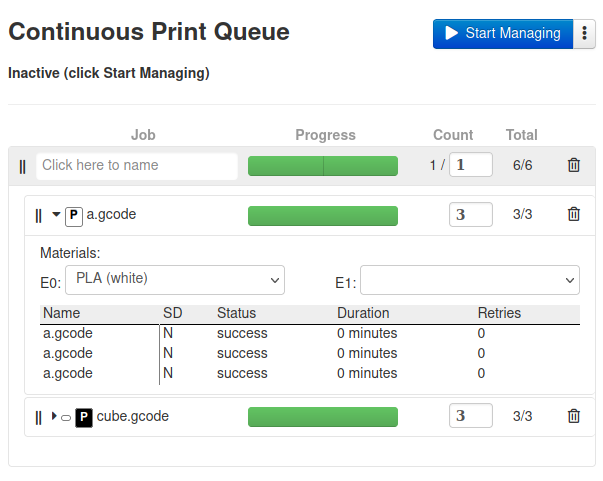

# Material Selection (BETA)

Follow the steps in this guide to support tagging queued items with specific material requirements.

## Enabling material selection

Octoprint doesn't know by default what spools of filament you have on hand, nor what's loaded into which hotend of your printer. For this reason, we'll need to install [SpoolManager](https://plugins.octoprint.org/plugins/SpoolManager/), which manages all spool informations and stores it in a database.

Follow the [setup instructions](https://github.com/OllisGit/OctoPrint-SpoolManager#setup) for SpoolManager, then restart OctoPrint. 

To confirm everything's operational, go to `Settings > Continuous Print` and scroll to "Material Selection". If you see "Material selection is enabled", then you're good to go!

!!! Important

    Continuous Print only knows about the materials that you've defined in SpoolManager. Be sure to add a few spools before trying to select materials, or else you won't see any options available.

## Selecting materials

When you add a new print file to the queue, it assumes nothing about material by default - any material type and color will be used to print it.

Materials are implemented at the level of Sets (see [here](https://smartin015.github.io/continuousprint/getting-started/#use-jobs-to-group-your-print-files) for definition). If you want a set to print in a certain color or material, click the triangle next to its name. If material selection is enabled (as above), you should see drop-down boxes for each extruder your printer has. 

Select the desired materials for your desired hotends (called "tools" in OctoPrint parlance). If you leave a tool empty, it's considered unconstrained - any material will do.

As you select materials, you'll see labels appear next to the name of the set. These help indicate at a glance what sets are constrained, and how. You can hover over individual labels to see more details on what material is specified.

## Behavior

When the print queue reaches a set with a specific material selected, it will wait to start the set until you select a matching spool via SpoolManager for every tool with a specified material.

Note that the material (e.g. "PLA") and the color are all that's matched. If for instance you have more than one spool of black PLA, selecting any of these spools in SpoolManager is sufficient if the print requires black PLA.
